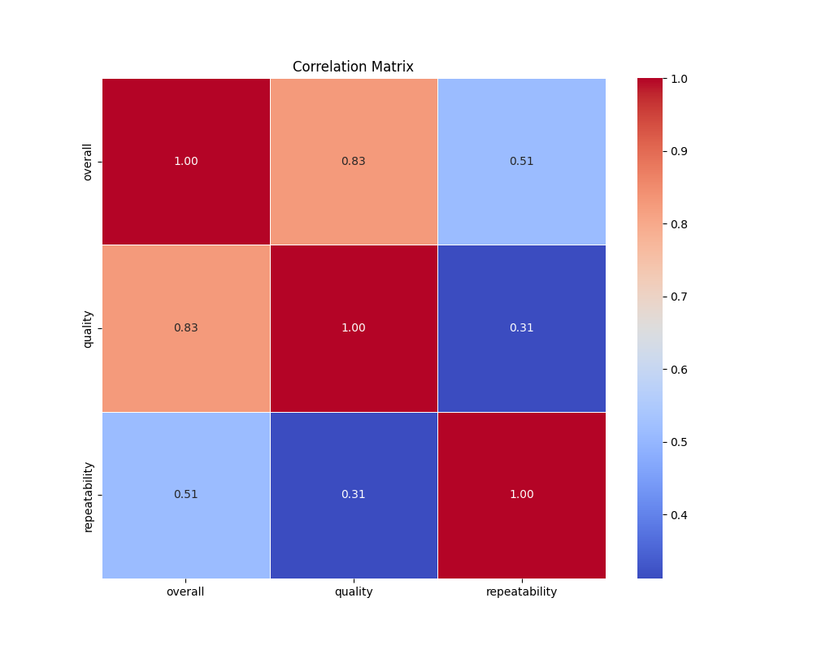
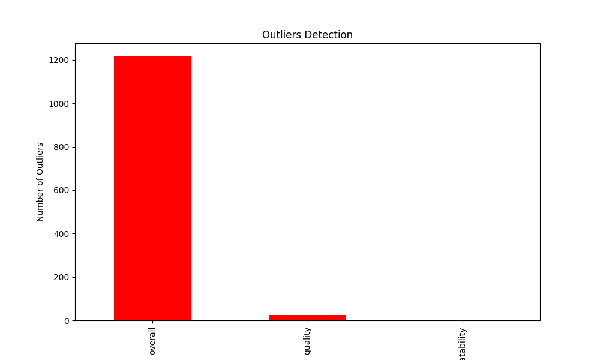
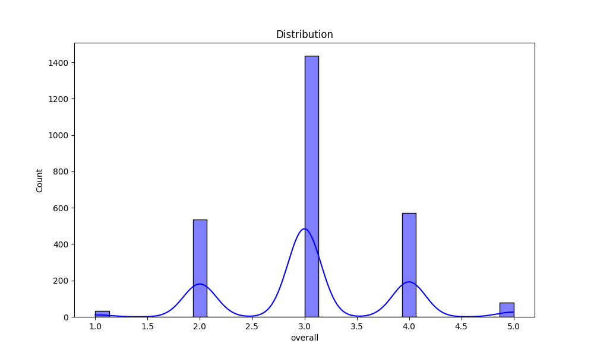

# Automated Data Analysis Report

## Introduction
This is an automated analysis of the dataset, providing summary statistics, visualizations, and insights from the data.

## Summary Statistics
The summary statistics of the dataset are as follows:

| Statistic    | Value |
|--------------|-------|
| overall - Mean | 3.05 |
| overall - Std Dev | 0.76 |
| overall - Min | 1.00 |
| overall - 25th Percentile | 3.00 |
| overall - 50th Percentile (Median) | 3.00 |
| overall - 75th Percentile | 3.00 |
| overall - Max | 5.00 |
|--------------|-------|
| quality - Mean | 3.21 |
| quality - Std Dev | 0.80 |
| quality - Min | 1.00 |
| quality - 25th Percentile | 3.00 |
| quality - 50th Percentile (Median) | 3.00 |
| quality - 75th Percentile | 4.00 |
| quality - Max | 5.00 |
|--------------|-------|
| repeatability - Mean | 1.49 |
| repeatability - Std Dev | 0.60 |
| repeatability - Min | 1.00 |
| repeatability - 25th Percentile | 1.00 |
| repeatability - 50th Percentile (Median) | 1.00 |
| repeatability - 75th Percentile | 2.00 |
| repeatability - Max | 3.00 |
|--------------|-------|

## Missing Values
The following columns contain missing values, with their respective counts:

| Column       | Missing Values Count |
|--------------|----------------------|
| date | 99 |
| language | 0 |
| type | 0 |
| title | 0 |
| by | 262 |
| overall | 0 |
| quality | 0 |
| repeatability | 0 |

## Outliers Detection
The following columns contain outliers detected using the IQR method (values beyond the typical range):

| Column       | Outlier Count |
|--------------|---------------|
| overall | 1216 |
| quality | 24 |
| repeatability | 0 |

## Correlation Matrix
Below is the correlation matrix of numerical features, indicating relationships between different variables:

## Outliers Visualization
This chart visualizes the number of outliers detected in each column:

## Distribution of Data
Below is the distribution plot of the first numerical column in the dataset:

## Conclusion
The analysis has provided insights into the dataset, including summary statistics, outlier detection, and correlations between key variables.
The generated visualizations and statistical insights can help in understanding the patterns and relationships in the data.

## Data Story
## Story
**Title: The Symphony of Data: A Journey Through Insights**

**Introduction**

In the heart of a bustling city, a group of data analysts gathered in a sleek, modern office, their screens aglow with a world of numbers and patterns. They were tasked with unraveling the stories hidden within a treasure trove of data—2,652 entries that promised to unveil insights about overall quality and repeatability in a certain product line. Each data point was a note in a grand symphony, waiting to be orchestrated into a melody of understanding. Little did they know, they were about to embark on a journey that would reveal not just statistics, but the very heartbeat of their enterprise.

**Body**

As the analysts dove into the dataset, they first encountered the summary statistics, which painted a vivid picture of the performance metrics. The average score of 3.05 overall indicated a solid foundation, yet it left room for improvement. The quality metric, with a mean of 3.21, echoed a similar sentiment, suggesting that while the product was generally well-received, there were areas that could benefit from refinement. This was the first insight: mediocrity had settled in, and the potential for greatness was just within reach.

The analysts examined the distribution of scores, noting that a significant portion of the entries clustered around the lower end of the scale. With 1,216 outliers in the overall category, the team quickly identified a trend—a small number of products were dragging the average down, while a handful were shining examples of excellence. This dichotomy sparked a deeper investigation. What set the high performers apart? Was it the materials, the craftsmanship, or perhaps the input from customer feedback that had led to their success? 

Correlation analysis revealed a strong relationship between overall scores and quality, with a coefficient of 0.83. This meant that as quality improved, so too did the overall satisfaction of the users. However, the relationship between quality and repeatability was weaker, hinting at an underlying issue: while some products were high-quality, they lacked consistency in performance. This inconsistency could lead to customer disappointment, and the analysts felt a sense of urgency to address it.

Moreover, the missing data on the creator’s information (with 262 entries lacking the name of the creator) raised eyebrows. Questions flooded the analysts' minds: Who were the masterminds behind these products? Were they experienced artisans, or newcomers to the craft? The anonymity of the creators could be a double-edged sword, for it obscured accountability and recognition in a field where pride in one’s work could drive quality.

As they delved deeper, the analysts realized that the interplay of quality, overall satisfaction, and repeatability was akin to a delicate dance. It was clear that improving one aspect could have a cascading effect on the others. They envisioned a plan: to reach out to creators, gather feedback, and create a community of shared knowledge. This initiative aimed not only to elevate the quality of the products but also to foster a sense of pride and ownership among the creators, thereby enhancing repeatability.

**Conclusion**

As the day drew to a close, the data analysts compiled their findings into a comprehensive report, one that not only summarized the statistics but also told a compelling story. They understood that the dataset was more than just numbers; it was a reflection of the company’s journey and aspirations. The insights gleaned from the analysis would guide the team toward actionable strategies: improving training for creators, implementing quality control checkpoints, and fostering an environment of collaboration.

In the end, the symphony of data had revealed its harmonious message: the path to excellence was not a solitary one, but a collective effort that required understanding, communication, and commitment to improvement. As the analysts left the office, they felt invigorated, knowing they had the tools to transform their findings into a roadmap for success. They were ready to embark on the next chapter of their story, one where quality and repeatability would rise in perfect harmony, leading to a crescendo of customer satisfaction and brand loyalty.
